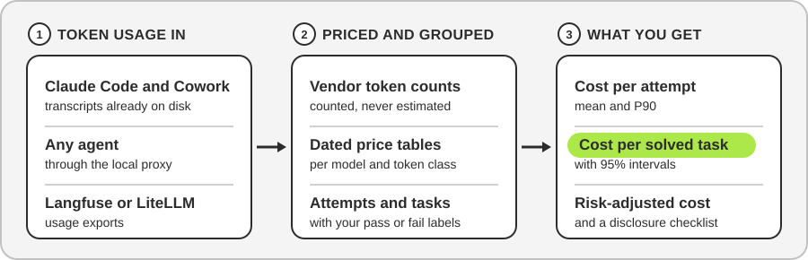

# cost-per-task

> Measure what an AI agent costs per task it completes correctly, not per million tokens.
> cost-per-task records the tokens each model call used, prices them from dated tables, and
> reports cost per attempt, cost per solved task and risk-adjusted cost per task, with the
> statistics needed to trust the figures.
> Built by [OptimNow](https://optimnow.io), implementing the measurement framework published
> by [DoiT](https://www.doit.com/research/economics-of-claude-openai-and-grok).

[](https://pypi.org/project/cost-per-task/)
[](https://pypi.org/project/cost-per-task/)
[](https://github.com/OptimNow/cost-per-task/actions/workflows/ci.yml)
[](#design-principles)
[](https://www.doit.com/research/economics-of-claude-openai-and-grok)
[](./LICENSE)

<p align="center">
  
</p>

---

## Get started in 30 seconds

```
pip install cost-per-task
```

Python 3.11 or later, no runtime dependencies, dated price tables included. If `cpt` is not
found after the install, the Python Scripts folder is not on your PATH, which is common on
Windows. `python -m cost_per_task.cli` is the same command: `python -m cost_per_task.cli report`
does what `cpt report` does.

Four words the commands and the report use:

- **Task**: a job to be done, such as fixing issue 142.
- **Attempt**: one try at a task, such as one Claude Code or Cowork session or one `cpt run`.
- **Step**: one model call inside an attempt.
- **Leak**: a result accepted as a pass and later found to be wrong.

Then pick the block that matches how you work:

<br>
**You use Claude Code or Cowork.** Measure the sessions already on your computer, with no
proxy, no API key and no extra spend:

```
cpt sessions summary
cpt sessions list
cpt sessions import
cpt report --cleanup-cost 25
```

The summary shows what your sessions would cost at API prices, by month and by model, before
any labelling. The list writes a sheet: give each session a task name and pass or fail, then
run the import; the sheet is the labelling step. The import prints the report command for
you. [Quick path](docs/claude-sessions.md#quick-path), six commands with what you should see, and
[guide](docs/claude-sessions.md).

<br>
**You run your own agent** against Anthropic, OpenAI or OpenRouter. Start it through the
local proxy, label the attempt, read the report:

```
cpt run --task-id issue-142 -- <the command that starts your agent>
cpt label pass --task issue-142
cpt report --cleanup-cost 25
```

The proxy records every model call the agent makes, streaming included, with no change to
the agent. Each `cpt run` is one attempt.

<br>
**You already log usage in Langfuse or LiteLLM.** Import the export, label the attempts in
bulk from a CSV, read the report:

```
cpt import langfuse observations.json    # or: cpt import litellm spend_logs.jsonl
cpt label --import labels.csv
cpt report --cleanup-cost 25
```

A Langfuse session becomes a task and each trace an attempt; LiteLLM rows are grouped by
`metadata.task_id` and `session_id` (`--task-field` and `--attempt-field` change this). The
CSV needs the columns `task_id`, `attempt_id`, `outcome` and `leaked`.

<br>
**You want an AI assistant to read the report.** Install the optional extra and start the
MCP server:

```
pip install "cost-per-task[mcp]"
cpt mcp
```

The assistant, or the [OptimNow AI ROI Calculator](https://airoicalculator.optimnow.io), then
reads the same figures from your log. The tools take the log and labels file names, so the
sessions files work too.

`cpt sessions` and the bundled price tables need version 0.5.0 or later. To work from a copy
of this repository instead, run `pip install -e .` in its folder. For a first run,
the [testing guide](docs/testing-guide.md) compares two models step by step and explains
every line of the report.

---

## Why cost per task

Model vendors price tokens. Businesses buy outcomes: a merged pull request, a resolved
ticket, a correctly filed invoice. For an agent that makes dozens of model calls, retries
when it fails and sometimes returns a wrong answer that looks right, the two units drift far
apart:

- **A cheaper model that fails more often can cost more per solved task,** because the
  failed attempts are paid for too.
- **Agent runs are heavy-tailed.** The same task can cost several times more on a bad run,
  so the average alone understates what you will budget.
- **An accepted wrong answer is not free.** Someone cleans it up later, and that cleanup
  belongs in the price of the task.

DoiT's paper *Cost Per Task, Not Cost Per Token: A Measurement Framework for the Real
Economics of Claude, OpenAI and Grok* (13 August 2026) sets out the formulas that turn token
counts into those business numbers. Logging usage per call was already solved by LiteLLM,
Helicone, Langfuse and OpenTelemetry. The missing half was attempts, outcomes, the division
by the success rate and the risk term. This tool supplies that half, for any model.

**Who it is for:** FinOps and finance teams who need a defensible cost per unit of AI work,
and engineers comparing two models on a real workload. It also serves anyone publishing agent
cost figures who wants them to carry the disclosures that make them checkable. If you can run
a command in a terminal, you can use it.

---

## What a report looks like

A real run: a Claude Code session answering a trivial prompt on Haiku, twice, with one of
the two answers labelled as a leak to show the risk term at work.

```
group: claude-haiku-4-5-20251001
  attempts 2 over 1 tasks; labelled 2 (pass 2, fail 0, leaked 1)
  attempt cost C: mean 0.0549 USD, P90 0.0557 USD, total 0.1099 USD
  success rate p: 1.000 (Wilson 95%: 0.342 to 1.000)
  CPT_solved = E[C] / p: 0.0549 USD (bootstrap 95%: 0.0549 to 0.0549, 10000 resamples)
  cost per task attempted (failures included): 0.1099 USD
  capped retries N=2: p_N 1.000
  pass^2: 1.000
  leak rate L: 0.500
  CPT_risk = CPT_solved + L x K: 12.5549 USD (K = 25.0000 USD)
  cache hit rate: 0.0%

disclosure checklist
  model versions: claude-haiku-4-5-20251001
  prices: as of 2026-08-27 in USD; source: OptimNow AI Pricing Hub, cross-checked against the vendor price list
  harness: Claude Code 2.1, -p mode
  ...
```

Two things this run shows that a per-token view hides. The question and its answer came to
68 tokens, yet 99% of the 5.5 cents went on Claude Code writing its 43,000-token system
context into the prompt cache. And with one answer in two flagged as a leak and a $25
cleanup cost, the risk-adjusted cost per task is $12.55, two hundred times the raw cost.

---

## What you get

Per model and per task type, the paper's estimators and what each one tells you:

| Reported | Formula | What it tells you |
|---|---|---|
| Attempt cost, mean and P90 | C_attempt = sum over calls of priced tokens (input, cache read, cache write, reasoning, output) | What one try costs, and what a bad try costs. Agent costs are heavy-tailed, so P90 is the budgeting number |
| Success rate p, with a Wilson 95% interval | passes / labelled attempts | How often a try works, and how sure you can be given how few tries you measured |
| Cost per solved task, with a bootstrap 95% interval | CPT_solved = E[C_attempt] / p, both over labelled attempts | What a correct result costs once failed tries are paid for. The headline number. Unlabelled attempts count in the mean above but not here; when there are any, the report prints the mean over labelled attempts as well |
| Cost per task attempted | total cost / distinct tasks | The same cost seen from the budget side, failures included, whether or not the task was ever solved |
| Capped-retry success p_N | 1 - (1 - p)^N | Chance of success within N tries |
| Consistency pass^k | share of tasks solved on every one of their first k tries | Whether the agent is reliable or lucky; single-try success rates hide collapse here |
| Leak rate L | leaked passes / passes | How often an accepted answer was wrong |
| Risk-adjusted cost per task | CPT_risk = CPT_solved + L x K | The cost once cleanup of leaked failures, K per leak, is counted |
| Break-even cleanup cost K* | (CPT_B - CPT_A) / (L_A - L_B) | For two models: below K* the cheaper, leakier one wins; above it the reliable one does |

Every report ends with the paper's **disclosure checklist**: model versions, prices with
dates and source, harness, cache hit rate, effort settings, sample size and k, the intervals
used, leak rate, the cleanup cost assumed, and K* for comparisons. The harness is the product
and settings the agent ran under, such as Claude Code 2.1 in print mode. With these attached,
a cost figure becomes a measurement someone else can check.

To compare two models directly:

```
cpt compare claude-haiku-4-5 claude-sonnet-5 --cleanup-cost 25
```

---

## How it works

**Three ways in, one log.** Whatever the source, each model call (a step) becomes one line in
a JSONL log. The line holds token counts by class, model, provider, task and attempt ids,
tool names, latency and the effort level requested. Outcomes go to a separate labels file, so
the usage log is never rewritten.

- **Local proxy.** `cpt run` starts a small web server on your machine and points the agent
  at it through `ANTHROPIC_BASE_URL` and `OPENAI_BASE_URL`, the standard variables every SDK
  honours. Requests reach the real API unchanged and responses come back unchanged,
  streaming included. On the way through, the proxy copies the vendor's own token counts.
- **Claude Code and Cowork transcripts.** Both products keep a transcript of each session on
  disk, with the usage block Anthropic returned for every response. `cpt sessions` reads
  them, counts each response once, folds sub-agent work into its parent session and gives
  you a spreadsheet to label.
- **Exports.** Langfuse observations and LiteLLM spend logs, as CSV, JSON or JSONL.

**Counted, never estimated.** Token counts come from the vendor's response, never from a
local tokenizer.

**Never logged.** API keys, headers, prompts and completions. Prompts often hold client data
and have no place in a metrics file. A test checks this on every commit.

**Attempts that mix models**, such as an agent using a small model for side calls, are
attributed to the model carrying the largest share of the cost.

---

## What it works with

| Source | How | Notes |
|---|---|---|
| **Anthropic** | proxy, any Claude model, plain or streaming | cache reads and 5-minute and 1-hour cache writes priced separately; reasoning billed inside output |
| **OpenAI** | proxy, Chat Completions and Responses APIs, plain or streaming | reasoning tokens split out of output; `stream_options.include_usage` added so streams report usage |
| **OpenRouter** and other OpenAI-compatible gateways | proxy, `--openai-upstream https://openrouter.ai/api` | native counts and the charged cost requested, then reconciled against list price; covers Gemini, Grok, Mistral, DeepSeek and the rest of what the gateway routes |
| **Claude Code and Cowork** | `cpt sessions summary`; `cpt sessions list`, then `cpt sessions import` | transcripts read from disk; subscription use is priced as a shadow cost, what the same tokens would cost at API list prices, since a subscription is not billed per token |
| **Langfuse** | `cpt import langfuse` | session as task and trace as attempt by default |
| **LiteLLM** | `cpt import litellm` | spend logs carry no cache breakdown, so imports show 0% cache hits |

Native adapters for Amazon Bedrock, Google Vertex AI and xAI are on the roadmap. Each is a
small file, because only the shape of the usage block differs between vendors. Statistics,
labels, report and comparison are model-agnostic already.

---

## Commands

| Command | What it does |
|---|---|
| `cpt run --task-id T [--task-type X] -- <command>` | run an agent command through the proxy, tagging every call with the task and a fresh attempt id |
| `cpt serve --port 4000 --task-id T` | run the proxy on its own and point any process at it |
| `cpt label pass\|fail [--task T] [--attempt A] [--leak]` | label the latest or a named attempt; `--import labels.csv` labels in bulk |
| `cpt sessions summary [--since D] [--by month] [--subscription P]` | what your Claude Code and Cowork sessions would cost at list prices, by product, model and period; no labels needed |
| `cpt sessions list`, then `cpt sessions import` | measure Claude Code and Cowork sessions from their transcripts, labelled in a spreadsheet |
| `cpt import langfuse\|litellm FILE` | convert a usage export into cpt records |
| `cpt report [--cleanup-cost K] [--harness H] [--json]` | the report, per model and task type |
| `cpt explain [--attempt A] [--task T]` | where one attempt's cost went: by token class, by model and the most expensive steps |
| `cpt compare A B [--cleanup-cost K] [--json]` | two-model comparison with the break-even cleanup cost K* |
| `cpt prices refresh --provider anthropic\|openai [--write]` | compare a price table with the OptimNow AI Pricing Hub; write only when asked |
| `cpt mcp` | serve the report to AI assistants over MCP (optional extra) |

Useful options on `report` and `compare`: `--log` and `--labels` to read other files than
`cpt-log.jsonl` and `cpt-labels.jsonl`, and `--prices` to use your own tables (repeatable).
`--leak-rate` overrides the measured L, `--retry-cap N` and `--k` set N and k, and `--seed`
makes the bootstrap intervals reproducible. `--task-type` keeps one task type, and on
`report` `--by-model-only` ignores task types.

---

## Prices

Prices live in dated JSON tables, one per vendor, per model and token class, per million
tokens. A table without an `as_of` date is refused, because the disclosure checklist requires
prices with dates. The Anthropic and OpenAI tables ship with the tool and apply when you do
not pass `--prices`; pass your own table to use negotiated rates.

```json
{
  "currency": "USD",
  "as_of": "2026-09-13",
  "source": "OptimNow AI Pricing Hub, cross-checked against platform.claude.com",
  "models": {
    "claude-sonnet-5": {
      "input_per_mtok": 2.0,
      "cache_read_per_mtok": 0.2,
      "cache_write_5m_per_mtok": 2.5,
      "cache_write_1h_per_mtok": 4.0,
      "output_per_mtok": 10.0,
      "reasoning_per_mtok": null
    }
  }
}
```

`reasoning_per_mtok: null` means reasoning is billed at the output rate, which is how both
vendors price today. Model ids reported with a date suffix (`claude-haiku-4-5-20251001`) or a
gateway prefix (`anthropic/claude-haiku-4.5`) match the table automatically.

**Keeping prices current.** The [OptimNow AI Pricing Hub](https://github.com/OptimNow/ai-pricing-hub-mcp),
which serves the [OptimToken](https://optimtoken.optimnow.io) catalogue of 250+ models
refreshed daily, is the upstream:

```
cpt prices refresh --provider anthropic            # shows what would change
cpt prices refresh --provider anthropic --write    # accepts it
```

The default run lists new, removed and repriced models with the catalogue date, warns about
models the hub cannot price fully and flags cache-read prices that look wrong. Nothing is
written without `--write`, so an upstream feed error never lands unseen.

**A call keeps the price of its day.** `--write` does not overwrite the old rates: the
previous table moves under `history` in the same file, with its own `as_of` date. Every
report then prices each call with the snapshot in force on the day the call ran, so a price
change never moves the cost of past sessions. The disclosure checklist lists the snapshots
it used and how many calls each one priced. Two cases are stated rather than hidden:

- a call older than the first snapshot of its model is priced with that first snapshot, and
  the report counts those calls;
- `as_of` is the day a price was read, not the day the vendor changed it. When you know the
  vendor's date from a source you can cite, add `"effective_from": "YYYY-MM-DD"` to that
  snapshot and it is used instead.

To re-price everything on purpose, for instance "what would last quarter cost at today's
rates", pass `--prices-as-of latest` or `--prices-as-of 2026-09-01` to `report`, `compare`,
`explain`, `sessions list` or `sessions summary`. The checklist says so when you do.

**Known limitation.** One rate per token class. Batch discounts, fast mode, the priority tier
and data residency surcharges are not modelled, nor is OpenAI's long-context tier above 272K
input tokens on GPT-5.5 and GPT-5.4: attempts that cross it are understated, and the report
states which prices it applied. Claude 4.6 and later models have no such tier: Anthropic bills
the full 1M-token window at the standard rate (pricing page, read on 2026-09-14).

---

## For AI assistants and other tools

`cpt report --json` and `cpt compare --json` emit the summaries as JSON. The same figures are
available over MCP, so an assistant can answer "what does a solved ticket cost us on Sonnet,
with the interval?" from your own log. The
[OptimNow AI ROI Calculator](https://airoicalculator.optimnow.io) can use CPT_risk as its cost
denominator instead of a per-token guess:

```
pip install "cost-per-task[mcp]"
cpt mcp
```

Tools: `cpt_report`, `cpt_compare` and `cpt_risk_denominator` (CPT_risk for one model with
sample size, intervals and price date). The `mcp` extra is the only optional dependency; the
core has none.

---

## Directory structure

```
cost-per-task/
├── README.md                 <- This file
├── LICENSE                   <- MIT
├── CHANGELOG.md              <- Release notes
├── CLAUDE.md                 <- Project context and hard rules for AI assistants
├── assets/                   <- The README diagram and the social preview image
├── docs/                     <- Testing guide, Claude Code and Cowork guide
├── examples/                 <- Scripts and tasks used by the testing guide
├── prices/                   <- Dated price tables, shipped inside the package too
├── src/cost_per_task/        <- The package: proxy, provider adapters, importers, pricing, statistics, report, cli
├── tests/                    <- pytest; proxy tests run against fake vendor servers
└── .github/workflows/        <- CI, and the PyPI release on version tags
```

[CLAUDE.md](CLAUDE.md) lists every module in `src/cost_per_task/` with its role.

---

## Design principles

- **Token counts come from the vendor, never from a local tokenizer.** The paper's first
  rule, and the difference between a measurement and an estimate.
- **No number without a date and a source.** Price tables carry `as_of` and `source`, and
  the report repeats them. A table without a date will not load.
- **Never invent a price.** The Pricing Hub refresh skips models it cannot fully price and
  flags anomalies rather than guessing; a person decides with `--write`.
- **Never log content.** Keys, headers, prompts and completions stay out of the log,
  enforced by a test.
- **Report the spread, not only the mean.** P90, Wilson and bootstrap intervals are always
  shown, so a small sample reads as a wide interval instead of hiding.
- **The log is append-only.** Outcomes and corrections live in the labels file.
- **Nothing to install around it.** Standard library only. The MCP server is the one
  optional extra, and it is imported only when asked for.

---

## Status

Version 0.6.0 is on PyPI. What has been checked, and how:

| Part | How it was checked |
|---|---|
| Anthropic capture through the proxy | live runs with Claude Code and with a direct API client, September 2026 |
| Two-model comparison | a live run of the testing guide's Level 1 on Claude Fable 5 and Fable 5.1 |
| Claude Code and Cowork importer | 527 real sessions on Windows, one of them cross-checked against an independent calculation |
| OpenAI, OpenRouter, Langfuse and LiteLLM | built from the vendors' documentation and tested against fake servers and synthetic exports, not yet on live traffic |

Roadmap: live validation of OpenAI and OpenRouter, importers checked on real exports, Amazon
Bedrock, Google Vertex AI and xAI adapters, long-context price tiers.

---

## Contributing

The most valuable contributions are real logs and real exports: "we ran this through the
proxy and the invoice said X" is worth more than any feature. Provider adapters, corrections
to pricing rules with a source, and adversarial review of the statistics are also welcome.
Open an issue first for anything structural.

---

## About OptimNow

OptimNow is a boutique FinOps consultancy helping organisations connect cloud and AI spend
to measurable business value. Based in France with European reach.

- Website: [optimnow.io](https://optimnow.io)
- LinkedIn: [OptimNow](https://linkedin.com/company/optimnow)
- GitHub: [github.com/OptimNow](https://github.com/OptimNow)

**Open-source tools built by OptimNow:**

| Tool | What it does |
|---|---|
| [OptimToken](https://optimtoken.optimnow.io) | Compare what 250+ models cost per request, with caching and batch factored in, plus compute instance rates across seven clouds. Also an MCP connector; `cpt prices refresh` reads from it |
| [Cloud FinOps Skill & MCP](https://github.com/OptimNow/cloud-finops-skills) | FinOps knowledge for AI agents: cloud cost, AI inference economics, allocation, chargeback, waste detection runbooks |
| [AI ROI Calculator](https://airoicalculator.optimnow.io) | Whether an AI project pays for itself: three-layer cost model, payback, break-even, sensitivity. Also an [MCP server](https://github.com/OptimNow/ai-roi-calculator-mcp); `cpt mcp` feeds it CPT_risk |
| [AI Cost Readiness Assessment](https://aicostsfinops.optimnow.io) | Where your organisation stands on AI cost management |

---

## Acknowledgements

The measurement model implemented here is the work of **[DoiT](https://www.doit.com)**. That
covers the token classes, cost per solved task, the capped-retry variant, the risk-adjusted
cost with leak rate and cleanup cost, the break-even cleanup cost K*, the choice of Wilson and
bootstrap intervals, pass^k and the disclosure checklist. It is published as *Cost Per Task,
Not Cost Per Token: A Measurement Framework for the Real Economics of Claude, OpenAI and Grok*
(DoiT Research, 13 August 2026), under [CC BY 4.0](https://creativecommons.org/licenses/by/4.0/):
<https://www.doit.com/research/economics-of-claude-openai-and-grok>. Read the paper for the
reasoning behind each estimator; this repository makes them runnable, and the formula names
in the report (C_attempt, CPT_solved, CPT_risk, K*) follow the paper so the two can be read
side by side.

Prices come from the OptimNow AI Pricing Hub and are cross-checked against the vendors'
published price lists, with the date of each check recorded in the tables.

This tool is independently maintained by OptimNow and is not affiliated with or endorsed by
DoiT, Anthropic, OpenAI or OpenRouter. Any implementation errors are ours.

---

## License

Released under the [MIT License](./LICENSE), copyright 2026 OptimNow. You may use, modify and
redistribute the software, including commercially, provided the copyright and licence notice
are kept. The methodology remains DoiT's, published under CC BY 4.0: please cite their paper
when you publish figures produced with this tool.
